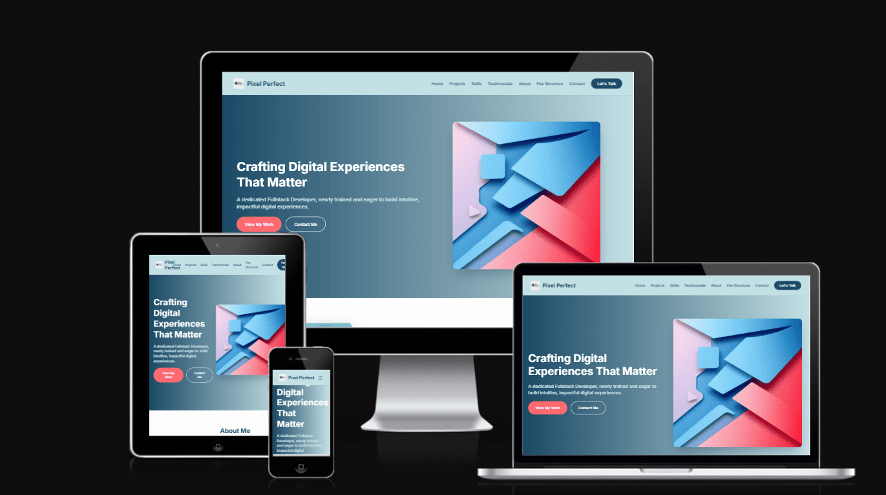

# Estelle Specht - Digital Portfolio

[Portfolio Live Site](https://ui.dev/amiresponsive?url=https://estii20.github.io/ux_portfolio/index.html)

## Welcome to My Digital Portfolio! 👋

Explore a collection of my work in software development, where I transform ideas into engaging digital experiences. This repository showcases my proficiency in full-stack development, with a particular focus on crafting intuitive user interfaces and robust backend systems.

## About Me

Throughout my career, I've demonstrated diligence, effective communication, and meticulous attention to detail, thriving in collaborative environments. As a native English speaker with a background in event management, I've honed valuable soft skills in customer service and communication.

Having recently completed a Diploma in Fullstack Software Development, I bring a comprehensive skill set proficient in HTML, CSS, Python, Django, JavaScript, and other key technologies. My passion lies in combining technical expertise with a proven track record to create captivating and user-centered digital solutions.

## Portfolio Highlights

Here are some of the key projects featured in this portfolio:

* **Marinex - Frontend Project:** A comprehensive frontend website for a new marine consultancy company, launched to establish their online presence. ([View Case Study](https://estii20.github.io/ux_portfolio/marinex.html))
* **Finance Dashboard:** A UI design project for an intuitive financial management platform with real-time data visualization. ([View Case Study](https://estii20.github.io/ux_portfolio/finance_hub.html))
* **Fitness Tracking App:** A mobile application design focused on UX research to help users track their fitness journey with personalized workout plans. ([View Case Study](https://estii20.github.io/ux_portfolio/fitness_app.html))
* **E-commerce Platforms:** Includes projects like a full-scale e-commerce solution for "Kidswap" and "Casa Artigiana," showcasing advanced filtering and seamless checkout experiences. ([View Case Study: Kidswap](https://estii20.github.io/ux_portfolio/e_commerce.html), [View Case Study: Casa Artigiana](https://estii20.github.io/ux_portfolio/casa_artigiana.html))
* **Healthy Habits Coach App:** A mobile application designed with UX/UI principles to help adults develop and maintain healthy lifestyle habits. ([View Case Study](https://estii20.github.io/ux_portfolio/healthy_habits.html))
* **Other Projects:** This portfolio also includes projects such as Aquileia Roman City, Water Cycle Quiz, Guest Feedback Form, Dolce Vita Blog, Perfect Pointes, and EkoTera, demonstrating a wide range of development challenges and solutions.

## Skills & Technologies

My diverse skill set covers the full software development lifecycle:

**Frontend Development:**
* HTML5
* CSS3 (Tailwind CSS, Bootstrap)
* JavaScript
* UI Design
* UX Research
* Interactive Prototyping
* UI Design Systems

**Backend Development:**
* Python
* Django

**Databases:**
* ElephantSQL

**Cloud & Deployment:**
* AWS
* Heroku

**Tools & Methodologies:**
* Git (Version Control)
* Balsamiq (Wireframing)
* Figma
* Problem Solving
* Agile Methodologies
* Teamwork & Collaboration
* Organisational Skills

## How to Navigate This Portfolio

1.  **View Online:** The easiest way to explore my projects is by visiting my live portfolio website: [Your Portfolio URL Here (e.g., https://yourusername.github.io/your-portfolio-repo)]
2.  **Explore Projects:** Each project listed above links to its dedicated case study page within the portfolio, providing more in-depth details, design processes, and outcomes.
3.  **Browse Code:** You can navigate through the directories in this repository to view the source code for each project.

## Get In Touch

I'm always open to discussing new opportunities and collaborations. Feel free to connect!

* **Email:** [email me](estellespecht@hotmail.co.uk)
* **LinkedIn:** [View my LinkedIn Profile](https://www.linkedin.com/in/estelle-specht-947ba526/)
* **GitHub:** [View my GitHub](https://github.com/estii20)

Thank you for visiting my portfolio!